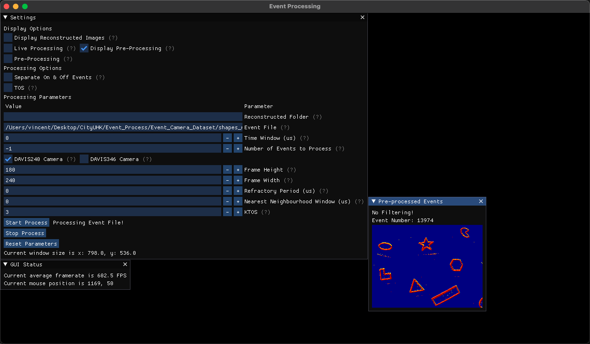
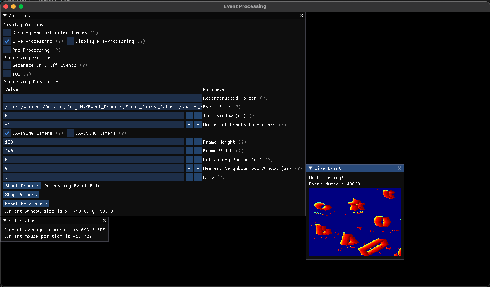
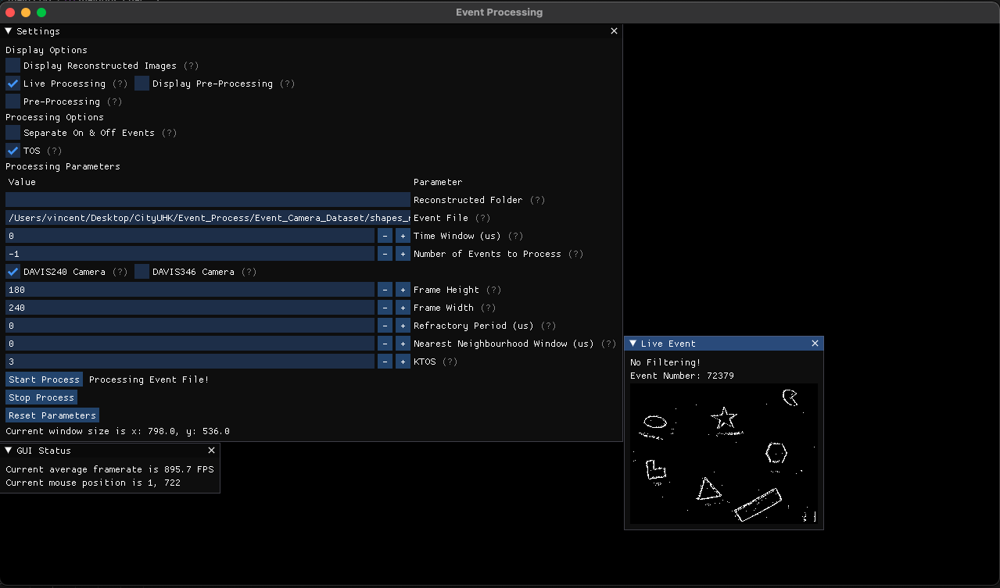
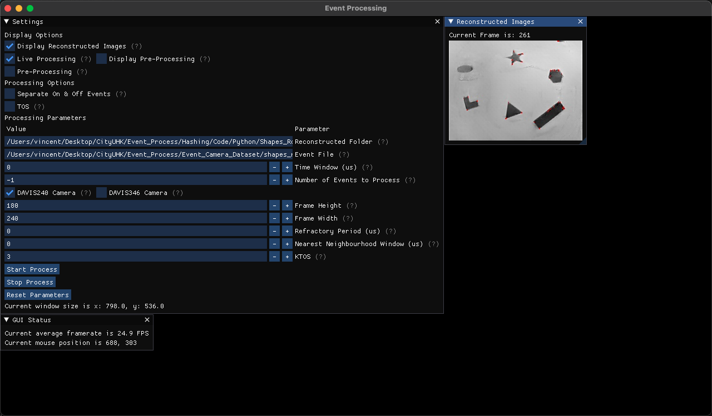

# Event-Processing-GUI
## This project is a WIP

This repository contain a GUI made in C++ using Dear ImGui library with GLFW/OpenGL3 as it backend.
The purpose of this GUI is to help user visualise the event data stored as txt file from https://rpg.ifi.uzh.ch/davis_data.html.

User can also convert any of their event data file into the same format for this GUI.

The txt file format can be seen below:
```
timestamp(s) x y p
```
For example, the first five lines from the Shapes_Rotation dataset's event.txt contains the following:
```
0.000000000 33 39 1
0.000011001 158 145 1
0.000050000 88 143 0
0.000055000 174 154 0
0.000080001 112 139 1
```

## GUI in Action (Event Processing)

As seen in the screenshot above, the GUI is capable of the following:
* Process events with or without filtering.
* Can filter with Refractory Filtering and/or Nearest Neighbourhood Filtering.
* Can store the events as either a traditional Time Surface or a Threshold Ordinal Surface (TOS) (Glover et al, 2021).
* The events can be processed live as if they are being streamed from a DVS/DAVIS camera, or can be viewed after all of the preprocessing are complete.

## GUI in Action (Live Processing - Time Surface)

As seen in the screenshot above, the GUI can process the event text file as though it is reading the events from the camera directly.
* Here a vanilla Timestamp based Time Surface is used to store events.

## GUI in Action (Live Processing - TOS)

As seen in the screenshot above, the GUI can process the event text file as though it is reading the events from the camera directly.
* Here a TOS is used to store events.

## GUI in Action (View Reconstructed Images)

As seen in the screenshot above, the GUI can also display reconstructed images frame by frame.
These reconstructed images are generated from events with the help of https://github.com/uzh-rpg/rpg_e2vid.